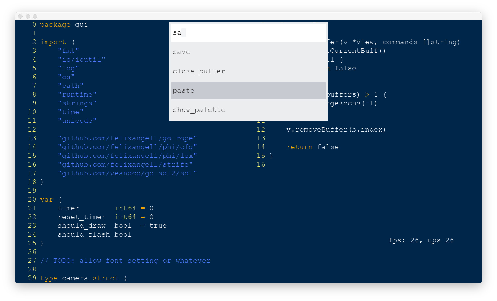

<p align="center"></p>

<h1>phi</h1>
Phi is a minimal code editor designed to look pretty, run fast, and be easy
to configure and use. It's primary function is for editing code.

The editor is still a work in progress. There is a chance it will **eat up your battery**, **run quite slowly**, 
and probably **crash frequently**.

**Do not edit your precious files with this editor!**

<br>

Here's a screenshot of Phi in action:

<p align="center"></p>

# goals
The editor must:

* run fast;
* load and edit large files with ease;
* look pretty; and finally
* be easy to use

## non-goals
The editor probably wont:

* have any plugin support;
* be very customizable in terms of layout;
* support many non utf8 encodings;
* support non true-type-fonts;
* support right-to-left languages;

Perhaps in the future if I have time to get round to some of these
I may. Avoiding most of these is to avoid complexity in the code-base
and general architecture of the editor.

# why?
The editor does not exist as a serious replacement to Sublime Text/Atom/Emacs/[editor name here]. 

Though one of my big goals for the project is to possibly replace sublime text for my own personal use. Thus the editor is somewhat optimized for my own work-flow.

The code is up purely for people to look at and maybe use or contribute or whatever. Sharing is caring!

# reporting bugs/troubleshooting
Note the editor is still unstable. Please report any bugs you find so I can
squash them! It is appreciated if you skim the issue handler to make sure
you aren't reporting duplicate bugs.

## before filing an issue
Just to make sure it's an issue with the editor currently and not due to a 
broken change, please:

* make sure the repository is up to date
* make sure all the dependencies are updated, especially "github.com/felixangell/strife"
* try removing the ~/.phi-config folder manually and letting the editor re-load it

# building
## requirements
You will need the go compiler installed with the GOPATH/GOBIN/etc setup. In addition
you will need the following libraries:

* sdl2
* sdl2_image
* sdl2_ttf

If you're on Linux, you will need:

* xsel
* xclip

Either works. This is for copying/pasting.

### linux
Here's an example for Ubuntu:

```bash
$ sudo apt-get install libsdl2-dev libsdl2-image-dev libsdl2-ttf-dev xclip
$ go get github.com/felixangell/phi
$ cd $GOPATH/src/github.com/felixangell/phi
$ go build
$ ./phi
```

### macOS
If you're on macOS, you can do something like this, using homebrew:

```bash
$ brew install sdl2 sdl2_image sdl2_ttf pkg-config
$ go get github.com/felixangell/phi
$ cd $GOPATH/src/github.com/felixangell/phi
$ go build
$ ./phi
```

### windows
Building on Windows is a bit more involved. It's the same process, though you will need a bit
more software:

* Install mingw-w64 from [mingw-builds](http://mingw-w64.org/doku.php/download/mingw-builds)
	* Version: `latest` (e.g. `7.3.0`);
	* Architecture: `x86_64`;
	* Threads: `win32`;
	* Exceptions: `seh`;
	* Build Revision: `latest`;
	* Destination folder: any folder your user owns, e.g. `C:/Users/yourname/documents`
* Install SDL2, SDL2_img, and SDL2_ttf from here: [sdl2](http://libsdl.org/download-2.0.php), [sdl2_image](https://www.libsdl.org/projects/SDL_image), [sdl2_ttf](https://www.libsdl.org/projects/SDL_ttf)
	* Extract these zip files;
	* Copy the `x86_64-w64-mingw32` into your mingw folder specified when installing mingw-w64.
* Add the `mingw` bin folder to the `PATH`

Once this is complete, open up a terminal and type the following:

```bash
$ go get github.com/felixangell/phi
$ cd $GOPATH/src/github.com/felixangell/phi
$ go build
$ ./phi
```

Note that you should run `go install` so that the dependencies aren't being rebuilt for faster compile times.

## configuration
Configuration files are stored in `$HOME/.phi-editor/config.toml`. Note that
this directory is created on first startup by the editor, as well as the configuration
files in the 'cfg/' directory are pre-loaded dependening on platform: see 'cfg/linuxconfig.go', for example.

Below is an incomplete configuration file to give you an
idea of what the config files are like:

```toml
[editor]
tab_size = 4
hungry_backspace = true
tabs_are_spaces = true
match_braces = false
maintain_indentation = true
highlight_line = true

[render]
aliased = true
accelerated = true
throttle_cpu_usage = true
always_render = true

[theme]
background = 0x002649
foreground = 0xf2f4f6
cursor = 0xf2f4f6
cursor_invert = 0x000000

[cursor]
flash_rate = 400
reset_delay = 400
draw = true
flash = true

[commands]
[commands.save]
shortcut = "super+s"

[commands.delete_line]
shortcut = "super+d"
```

# license
[MIT License](/LICENSE)
